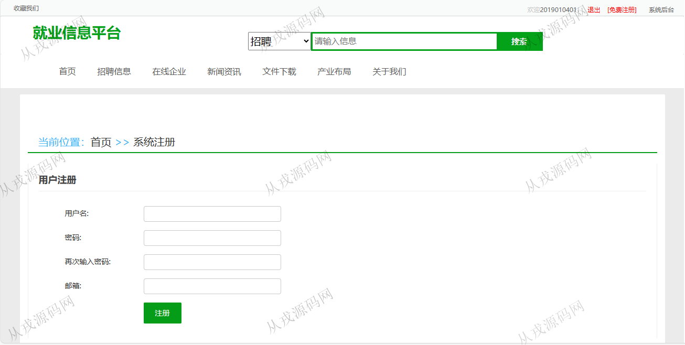
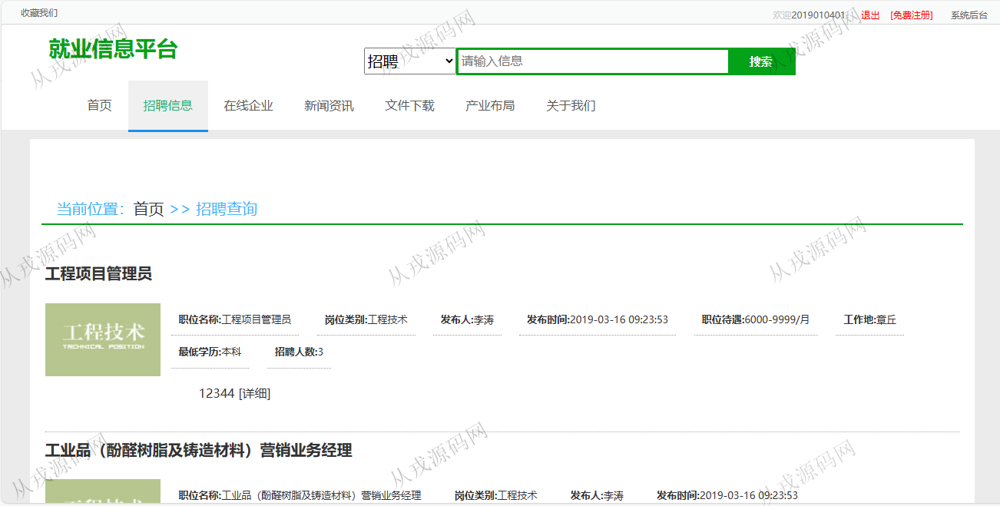
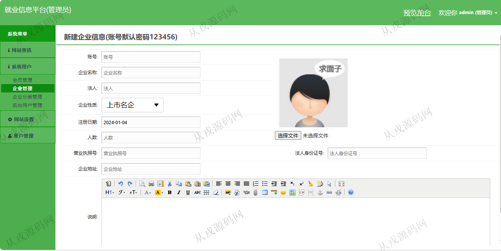

<h1 align="center">103.就业信息平台管理系统</h1>

- <b>完整代码获取地址：从戎源码网 ([https://armycodes.com/](https://armycodes.com/))</b>
- <b>技术探讨、资料分享，请加QQ群：692619798</b> 
- <b>作者微信：19941326836  QQ：952045282</b> 
- <b>承接计算机毕业设计、Java毕业设计、Python毕业设计、深度学习、机器学习</b>
- <b>选题+开题报告+任务书+程序定制+安装调试+论文+答辩ppt 一条龙服务</b>
- <b>所有选题地址 ([https://github.com/YuLin-Coder/AllProjectCatalog](https://github.com/YuLin-Coder/AllProjectCatalog)) </b>

## 项目介绍
基于ssm的就业信息平台管理系统：前端 jsp、jquery、jqueryui，后端 springmvc、spring、mybatis，角色分为管理员、企业、用户；集成招聘信息、投递简历、在线企业、新闻资讯等功能于一体的系统。

## 功能介绍

### 用户

- 基本功能：登录、注册、退出
- 网站首页：主导航栏，轮播图，系统公告，新闻资讯，招聘信息列表
- 招聘信息：招聘信息列表展示，招聘信息详情页，投递简历，评论
- 在线企业：企业信息列表，收藏，企业信息详情
- 新闻资讯：资讯列表，资讯详情，收藏，赞，踩
- 文件下载：内容列表展示，详情，附件下载，评论
- 产业布局：列表展示，详情，收藏，赞，踩，评论
- 账户信息：账号信息查看，修改，密码修改
- 会员中心：我的简历库，添加简历，应聘记录，我的收藏夹

### 企业

- 招聘管理：列表查询，关键词搜索，修改，详情，删除，查看应聘者列表，应聘者详情
- 发布招聘信息：富文本编辑，岗位类别
- 岗位管理：岗位信息的增删改查，按名称搜索
- 账户管理：修改密码，账号信息查看与修改

### 管理员

- 网站资讯：下载文档信息的增删改查，新闻资讯的增删改查，新闻栏目的增删改查，系统公告的增删改查，岗位信息的增删改查，会员评论查看与删除
- 系统用户：会员管理，企业管理，企业分类管理，后台用户管理
- 账户管理：修改密码，账号信息查看与修改
- 网站设置：网站导航管理，首页栏目管理，首页轮播图管理，系统设置管理

## 环境

- <b>IntelliJ IDEA 2021.3</b>

- <b>Mysql 5.7.26</b>

- <b>Tomcat 7.0.73</b>

- <b>JDK 1.8</b>

## 运行截图

